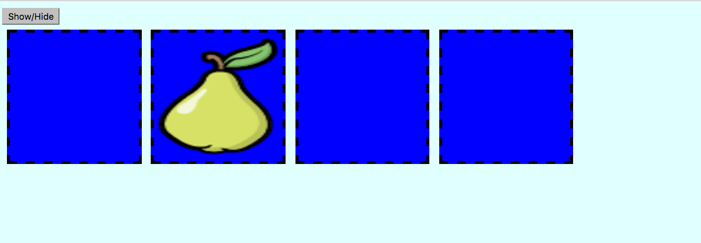

# jQuery Memory Game Assignment

Now that you're familiar with using jQuery to select elements and handle events, we can start to get some really cool functionality.

## Event-Driven Programming

When we structure our applications to do things in response to events, we call this event-driven programming. If you think of everything the user or browser does as an event, then all we need to do is determine which events we care about and write code to run when that event happens. This is the basis for interactive web pages.

## Memory Card Game

The best way to test your logic and event handling chops is to build something interactive, like a game. We're going to be building a Memory-like game using HTML, CSS, and jQuery/JS.

The objective of the game is to display a set of cards to the player. Each card contains a hidden fruit image. The player can reveal all of the fruits in order to memorize where they are. They can then click an individual card to reveal the image it contains, testing if they were able to memorize its location.

It may look something like this:

### Getting Started
Inside the `assignment` folder you will find another folder called `memory-game` that contains all the starter files for this assignment. You will find an `index.html` that contains four cards to start developing with. The `index.html` has linked the `style.css` and the `script.js`. Both of these files have some code to start with. You will need to edit `script.js` to get the game functionality working.

### Reveal All Button

The fruit in each card should be hidden when the page loads.

Create a button on the DOM that will, when clicked, reveal all of the fruits to the player.

Remember these are not physical cards. You can think of this more like adding and removing the fruit image from the DOM, while the card box stays put.

### Reveal One Fruit

Each card should reveal its own fruit when clicked. You will have to create an event listener and use the special jQuery `$(this)` selector to make sure you're only revealing the fruit of the clicked card.

[More on using $(this) in event handlers.](http://html-tuts.com/jquery-this-selector/)
